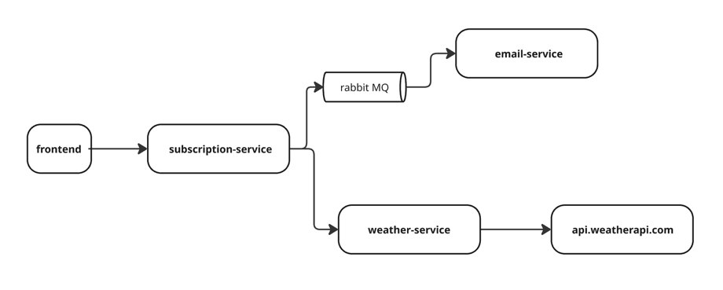

# Weather Subscription Service

This project lets you sign up for weather updates. Pick a city, and it will send you emails with the latest weather
info.

## How It Works

The system uses small programs that work together:

- **Subscription Service**: Where you sign up. It gets weather info and sends messages for emails.
- **Weather Service**: Finds weather data from the internet.
- **Email Service**: Sends you weather emails.

Here’s how they connect:


## What You Need

- **Docker**: A tool to run the programs. [Get Docker here](https://www.docker.com/get-started).
- **Docker Compose**: Comes with Docker to manage everything.

## How to Start It

1. **Get the Files**  
   Open a terminal and type:
   ```bash
   git clone https://github.com/1ulans1/wether-subscriber
   cd weather-subscriber
   ```

2. **Set Up Email**
    - Open `email-service/config/config.yaml` in a text editor.
    - Add your email info, like this (example for Gmail):
      ```yaml
      smtpHost: "smtp.gmail.com:587"
      smtpUser: "your-email@gmail.com"
      smtpPassword: "your-app-password"
      fromAddress: "your-email@gmail.com"
      ```
    - **Note**: For Gmail, make an [app password](https://support.google.com/accounts/answer/185833) if you use 2-factor
      authentication.

3. **Run It**  
   In the terminal, type:
   ```bash
   docker-compose up --build
   ```
    - Wait a bit for it to start.

4. **Try It Out**
    - Open a browser and go to `http://localhost:80` to sign up.
    - Or use the API at `http://localhost:8080` if you’re coding.